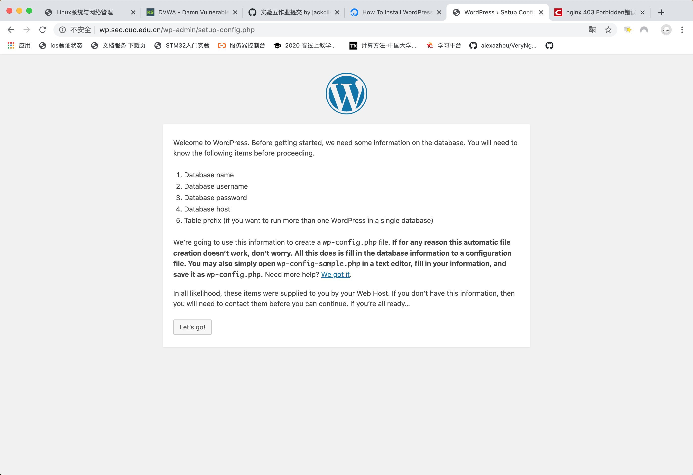

# 实验报告chap0x05
## 实验环境
- 主机系统：MacOS10.15
- ubuntu 18.04
- nginx version: nginx/1.14.0 (Ubuntu)
 
  built with OpenSSL 1.1.1  11 Sep 2018
- VeryNginx
- WordPress4.7


## 安装配置`VeryNginx`
   ### 安装依赖包
     
   + `sudo apt install libssl1.0-dev`

      `sudo apt install libpcre3 libpcre3-dev`
   + 安装`make`
    
     `sudo apt install make`
   
   + 安装`gcc`
    
     `sudo apt install gcc`
   + 安装`Zlib`
   
      `sudo apt-get install zlib1g.dev`

  ### 安装`VeryNginx`  
   - clone仓库到本地
  
     `git clone https://github.com/alexazhou/VeryNginx.git`
   
   + 安装VeryNginx
      `python install.py install`
  ### 配置`VeryNginx` 
  + 修改`/opt/verynginx/openresty/nginx/conf/nginx.conf`配置文件
    ```
    sudo vi /opt/verynginx/openresty/nginx/conf/nginx.conf
    ```
    ```
    修改的代码：
      1. user  www-data;
      2. server {
          listen       8080;
    ```
 

 + 在主机 host文件中添加一条对应的DNS解析``10.37.129.4 vn.sec.cuc.edu.cn``，即可使用域名访问`VeryNginx` 

+ 启动服务
  ```/opt/verynginx/openresty/nginx/sbin/nginx```

 + 主机访问 
  
  可见已成功安装并配置`VeryNginx` 


## 安装配置 LNMP环境
### 安装`Nginx`
  `sudo apt install nginx`
### 配置`Nginx`
- 修改监听端口为80
  `sudo vi /etc/nginx/sites-enabled/default`
  ```
    修改的代码：
    server {
            listen 80 default_server;
            listen [::]:80 default_server;

  ```
- 启动`Nginx`
 
  ` sudo systemctl start nginx`


- 主机访问 
  
  可见已成功安装并配置`Nginx` 
### 安装配置MySQL
- 安装 `sudo apt install mysql-server`
- 配置 `sudo mysql_secure_installation`
### 配置安装php
- 安装php
  ```
  sudo add-apt-repository universe
  sudo apt install php-fpm php-mysql
  ```
- 修改nginx配置PHP-FPM进程的反向代理配置在nginx服务器上 保存退出
  ```
   location ~ \.php$ {
                include snippets/fastcgi-php.conf;
        #
        #       # With php-fpm (or other unix sockets):
                fastcgi_pass unix:/var/run/php/php7.2-fpm.sock;
        #       # With php-cgi (or other tcp sockets):
        #       fastcgi_pass 127.0.0.1:9000;
        }

  ```
- 重启nginx
```
 sudo systemctl restart nginx
 ```


## 安装配置WordPress4.7
  - 通过scp将wordpress安装包传送到ubuntu
  ```
  scp /Users/endless/Downloads/WordPress-4.7.zip  cucserver@10.37.129.4:~ 
  ```
  - 安装unzip `sudo apt install unzip`
  - 解压安装包`unzip wordpress-4.7.zip`
  - 将解压后的wordpress移到指定路径
  ```
  sudo mkdir /var/www/html/wp.sec.cuc.edu.cn
 sudo cp -r  WordPress-4.7 /var/www/html/wp.sec.cuc.edu.cn
  ```
  ### 配置数据库
  ```
  CREATE DATABASE wordpress DEFAULT CHARACTER SET utf8 COLLATE utf8_unicode_ci;
  
  Query OK, 1 row affected (0.00 sec)

  GRANT ALL ON wordpress.* TO 'wordpressuser'@'localhost' IDENTIFIED BY 'password';
  FLUSH PRIVILEGES;
  EXIT; 
  ```
  ### 安装php插件
  ```
  sudo apt update
  sudo apt install php-curl php-gd php-intl php-mbstring php-soap php-xml php-xmlrpc php-zip

  sudo systemctl restart php7.2-fpm
  ```
  ### 配置Nginx
  ```
  sudo vim /etc/nginx/sites-enabled/default

  root /var/www/html/wp.sec.cuc.edu.cn;
  ```
  - 添加Host解析`10.37.129.4 http://wp.sec.cuc.edu.cn/`

  - 访问域名
  
  可见已成功配置
  
  - 按部就班进行WordPress配置
  
  
## 安装配置DVWA
- 下载DVWA
  ```
  sudo git clone https://github.com/ethicalhack3r/DVWA /tmp/DVWA
  ```
- 移动到网站文件夹
  ```
  sudo mv /tmp/DVWA /var/www/html
  ```
- 重命名文件
```
sudo cp /var/www/html/DVWA/config/config.inc.php.dist /var/www/html/DVWA/config/config.inc.php
```
- 在mysql为DVWA新建一个用户名, 修改DVWA中的配置,用于连接mysql数据库
```
#首先登陆mysql
#新建一个数据库dvwa
 CREATE DATABASE dvwa DEFAULT CHARACTER SET utf8 COLLATE utf8_unicode_ci;

#新建一个用户dvwauser，分配管理dvwa的权限，设置密码 刷新并退出
 GRANT ALL ON dvwa.* TO 'dvwauser'@'localhost' IDENTIFIED BY 'p@ssw0rd';
 FLUSH PRIVILEGES;
 EXIT;
#重启mysql生效
sudo systemctl restart mysql
 
#打开DVWA的配置文件
 sudo vim /var/www/html/DVWA/config/config.inc.php
 
#修改配置文件为自己需要的内容 保存退出
 $_DVWA[ 'db_server' ]   = '127.0.0.1';
 $_DVWA[ 'db_database' ] = 'dvwa';
 $_DVWA[ 'db_user' ]     = 'dvwauser';
 $_DVWA[ 'db_password' ] = 'p@ssw0rd';
```
### 修改php配置
```
#修改配置文件 并保存退出
sudo vim /etc/php/7.2/fpm/php.ini

#设置以下项目
allow_url_include = on
allow_url_fopen = on
safe_mode = off
magic_quotes_gpc = off
display_errors = off

#修改完以后重启php-fpm使配置生效
```
#修改配置文件 并保存退出
sudo vim /etc/php/7.2/fpm/php.ini

#设置以下项目
allow_url_include = on
allow_url_fopen = on
safe_mode = off
magic_quotes_gpc = off
display_errors = off

#修改完以后重启php-fpm使配置生效
sudo systemctl restart php7.2-fpm
```

### 配置nginx 5566端口监听DVWA的访问
```
#打开nginx配置文件
sudo vim /etc/nginx/sites-enabled/default

#添加对应的监听模块
```
server {
        listen 5566；
        root /var/www/html/DVWA;
        index index.html setup.php index.htm index.php index.nginx-debian.html;
         location / {
                try_files $uri $uri/ =404;
          }
        #配置php-fpm反向代理
        location ~ \.php$ {
                include snippets/fastcgi-php.conf;
                fastcgi_pass unix:/var/run/php/php7.2-fpm.sock;
        }
    }
```
### 设置访问权限
`sudo chown -R www-data.www-data /var/www/html/DVWA`

### 重启nginx使配置生效
```
sudo systemctl restart nginx
```

## 总结
### 基本要求
- (√)在一台主机（虚拟机）上同时配置Nginx和VeryNginx
  + (√)VeryNginx作为本次实验的Web App的反向代理服务器和WAF
  + (√)PHP-FPM进程的反向代理配置在nginx服务器上，VeryNginx服务器不直接配置Web站点服务
- (√)使用Wordpress搭建的站点对外提供访问的地址为： http://wp.sec.cuc.edu.cn
- (√)使用Damn Vulnerable Web Application (DVWA)搭建的站点对外提供访问的地址为： http://dvwa.sec.cuc.edu.cn


## 遇到的问题以及解决方案
 1.  在配置好WordPress后访问域名显示`403Forbidden`
> 解决方案：修改nginx.conf中 user属性 为 `root`

## 参考文献
1. [VeryNginx官方安装说明文档](https://github.com/alexazhou/VeryNginx/blob/master/readme_zh.md)

2. [如何配置LNMP环境](https://www.digitalocean.com/community/tutorials/how-to-install-linux-nginx-mysql-php-lemp-stack-ubuntu-18-04)

3. [How To Install WordPress with LEMP on Ubuntu 18.04](https://www.digitalocean.com/community/tutorials/how-to-install-linux-nginx-mysql-php-lemp-stack-ubuntu-18-04)
4.  [`linux-2019-jackcily`的实验报告](https://github.com/CUCCS/linux-2019-jackcily/pull/5/files?file-filters%5B%5D=.PNG&file-filters%5B%5D=.jpg&file-filters%5B%5D=.md&short_path=98bd81e#diff-98bd81e028e11b2e227d23c8ffb15023)
5. [nginx 403 Forbidden错误的原因和解决方法](https://blog.csdn.net/ytp151730/article/details/79091170)
6. [DVWA](http://www.dvwa.co.uk/)