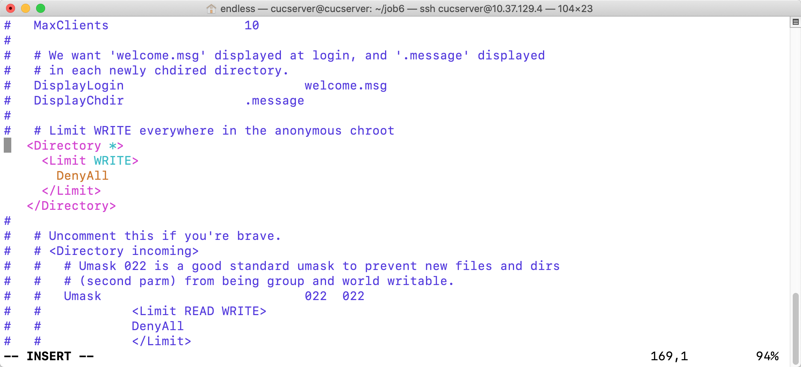

# 实验报告chap0x06
## 实验环境
本次实验使用了两台虚拟机。
#### 虚拟机1
- 名称：cucserver
- 系统：Ubuntu 18.04 Server
- 网卡：NAT+Host-Only(10.37.129.4)
- 安装ansible
#### 虚拟机2
- 名称：parallels
- 系统：Ubuntu 18.04 Desktop
- 网卡：NAT+Host-Only(10.37.129.5)
- 安装openssh-server和python-minimal

## 实验内容
### （√）配置cucserver到parallels的远程SSH root用户登录
1. 在cucserver上生成keygen`ssh-keygen -t rsa -P '' -f ~/.ssh/id_rsa`
2. 允许parallels以root身份登录`sudo vim /etc/ssh/sshd_config`,修改：
   ```
   PermitRootLogin yes
   ```
   - 重启`sudo reboot`
3. 运行脚本`/usr/bin/expect  ssh-root.sh 10.37.129.5 root 12345 ~/.ssh/id_rsa.pub`

### FTP服务器：ProFTPD
- （√）配置一个提供匿名访问的FTP服务器，匿名访问者可以访问1个目录且仅拥有该目录及其所有子目录的只读访问权限
- （√） 配置一个支持用户名和密码方式访问的账号，该账号继承匿名访问者所有权限，且拥有对另1个独立目录及其子目录完整读写（包括创建目录、修改文件、删除文件等）权限，（该账号仅可用于FTP服务访问，不能用于系统shell登录）
安装完成proftpd后，修改配置文件proftpd.conf，配置匿名用户对任意文件夹的只读权限。


- 安装完成proftpd后，修改配置文件proftpd.conf
```
 AuthOrder mod_auth_file.c mod_auth_unix.c
AuthUserFile /usr/local/etc/proftpd/passwd
AuthGroupFile /usr/local/etc/proftpd/group
PersistentPasswd off
RequireValidShell off
```
- 使用ftppasswd 创建passwd和group文件
```
#创建用户
spawn ftpasswd --passwd --file=/usr/local/etc/proftpd/passwd --name=${FTP_USER} --uid=1024 --home=/home/${FTP_USER} --shell=/bin/false
#创建组
ftpasswd --file=/usr/local/etc/proftpd/group --group --name=virtualusers --gid=1024
#将用户加入组
ftpasswd --group --name=virtualusers --gid=1024 --member=${FTP_USER} --file=/usr/local/etc/proftpd/group
#修改文件夹权限
if [[ ! -d "$path" ]] ; then
   mkdir  -p $path
   chown -R 1024:1024 $path
   chmod -R 700 $path
fi
```

- (√）FTP用户不能越权访问指定目录之外的任意其他目录和文件

    在proftpd.conf配置文件中，添加DefaultRoot ~ 限定用户只能访问自己的目录

- (√） 匿名访问权限仅限白名单IP来源用户访问，禁止白名单IP以外的访问
```
<Limit LOGIN>
       Order allow,deny
       Allow from 169.254.134.150
       Deny from all
</Limit>
```

## NFS
×
## Samba
修改配置文件smb.conf,guest 设置匿名共享目录，目录demo使用用户名密码可以进行读写。
```
[guest]
        # This share allows anonymous (guest) access
        # without authentication!
        path = /srv/samba/guest/
        read only = yes
        guest ok = yes

[demo]
        # This share requires authentication to access
        path = /srv/samba/demo/
        read only = no
        guest ok = no
        force create mode = 0660
        force directory mode = 2770
        force user = demoUser
        force group = demoGroup
        ```
```
- （√） Linux设置匿名访问共享目录/Linux设置用户名密码方式的共享目录
```
#安装
sudo apt install samba
#创建用户
useradd -M -s /sbin/nologin ${SMB_USER}
sudo passwd smbuser

#在linux中添加同名用户
smbpasswd -a smbuser
#使设置的账户生效
smbpasswd -e smbuser
#创建用户组并加入
groupadd smbgroup
usermod -G smbgroup smbuser
#创建用于共享的文件夹并修改用户组
mkdir -p /home/samba/guest/
mkdir -p /home/samba/demo/
chgrp -R smbgroup /home/samba/guest/
chgrp -R smbgroup /home/samba/demo/
chmod 2775 /home/samba/guest/
chmod 2770 /home/samba/demo/
#启动Samba
smbd
```


## DHCP
- (√)2台虚拟机使用Internal网络模式连接，其中一台虚拟机上配置DHCP服务，另一台服务器作为DHCP客户端，从该DHCP服务器获取网络地址配置
- 首先进行DHCP的安装和配置
 ```
 #修改server  /etc/network/interfaces配置文件
auto enp0s9
iface enp0s9 inet static
address 192.168.254.25
netmask 255.255.255.0
gateway 192.168.254.25
#server端安装需要使用的软件
apt install isc-dhcp-server
#修改server中/etc/default/isc-dhcp-server文件  配置提供DHCP服务的网卡
INTERFACES="enp0s9"
#修改server中/etc/dhcp/dhcpd.conf文件  添加如下配置如下
subnet 10.0.2.0 netmask 255.255.255.0 {
  range dynamic-bootp 10.0.2.65 10.0.2.100;
  option broadcast-address 10.0.2.255;
  option subnet-mask 255.255.255.0;
  default-lease-time 600;
  max-lease-time 7200;
}
#server端开启 isc-dhcp-server 服务
service isc-dhcp-server restart
 ```
- 在另一台ubuntu服务器中配置开启内部网卡的dhcp服务.

## DNS
- 安装bind9
```
#打开 /etc/bind/named.conf.local 添加以下内容
zone "cuc.edu.cn" {
    type master;
    file "/etc/bind/db.cuc.edu.cn"
};  

#创建保存域名解析的db文件
sudo cp /etc/bind/db.local /etc/bind/db.cuc.edu.cn


#编辑/etc/bind/db.cuc.edu.cn文件 添加需要解析的域名
wp.sec.cuc.edu.cn       IN      A       10.0.2.15
dvwa.sec.cuc.edu.cn     IN      CNAME   wp.sec.cuc.edu.cn.
test.com                IN      A       10.0.2.65

#重启服务
service bind9 restart
```

- 客户端配置
```
  #客户端添加解析服务器
sudo vim /etc/resolvconf/resolv.conf.d/head
	search cuc.edu.cn
	nameserver 10.37.129.4

#更新resolv.conf文件
sudo apt install resolvconf
sudo resolvconf -u
```

# 参考文献
1. [propftd错误解决-CSDN](https://blog.csdn.net/dongfei2033/article/details/81124465)

2. [linux/2017-1/snRNA/ex6/](https://github.com/CUCCS/linux/tree/master/2017-1/snRNA/ex6)

3. [Job6-linux-2019-jackcily](https://github.com/CUCCS/linux-2019-jackcily/pull/6/files?file-filters%5B%5D=.PNG&file-filters%5B%5D=.cn&file-filters%5B%5D=.conf&file-filters%5B%5D=.local&file-filters%5B%5D=.md&file-filters%5B%5D=.msg&file-filters%5B%5D=.sh&short_path=618f954#diff-618f954f5e6a222e171a573c26b953b1)