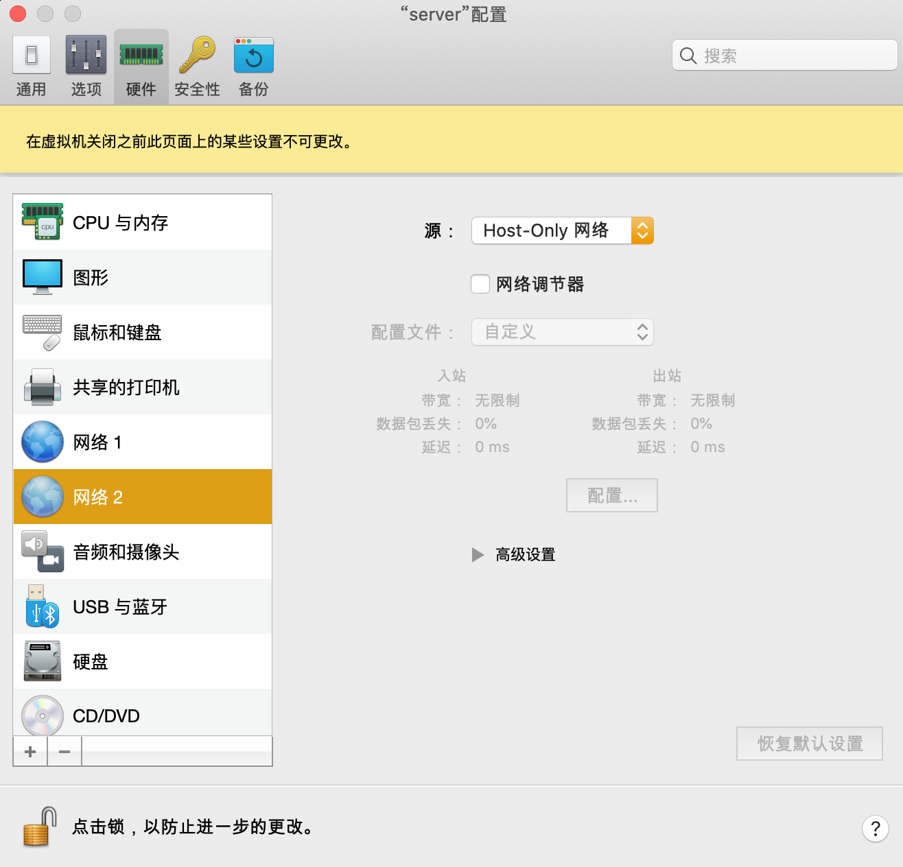
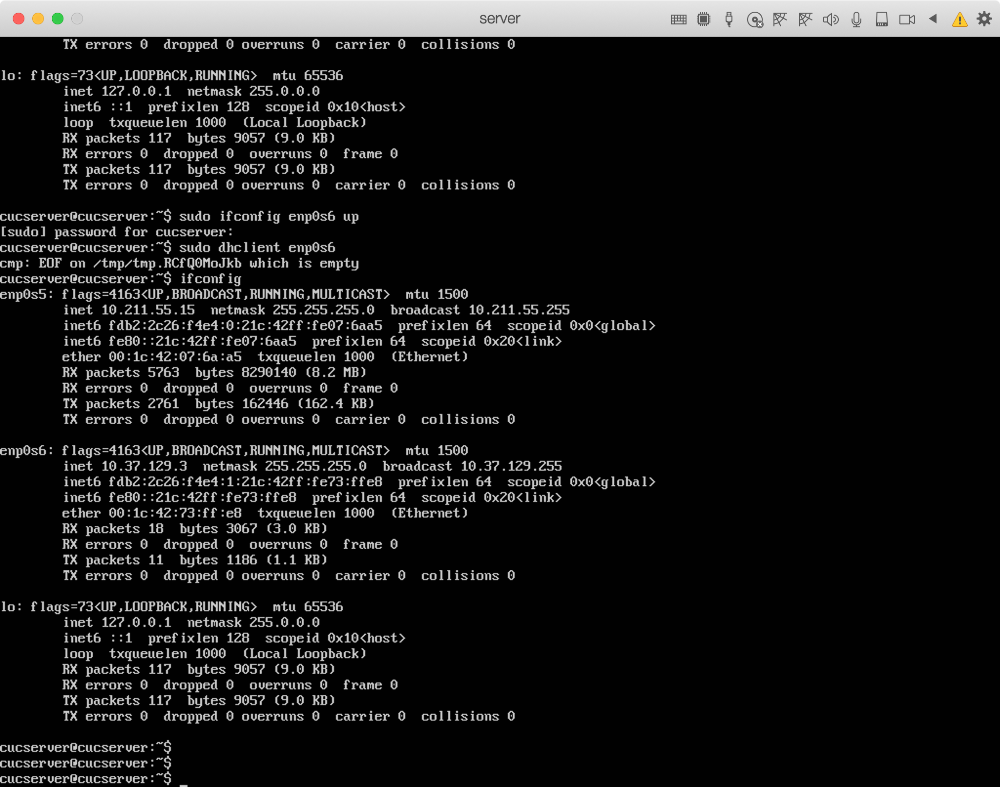

# 实验一：无人值守Linux安装镜像制作
## 实验名称：
> 无人值守Linux安装镜像制作


## 实验要求：
> 定制用户名和默认密码、定制安装OpenSSH Server、安装过程禁止自动联网更新软件包等


## 实验环境：
> Parallel Desktop、Ubuntu-18.04.4-server-amd64、Host-only+NAT、Mac terminal


## 实验步骤：
[安装过程8倍速视频链接-Biliili](https://www.bilibili.com/video/av97839323/)
1. 添加一块host-only网卡

2. 启动服务器，在服务器中启动网卡
   ```
   sudo ifconfig enp0s6 up
   ifconfig -a
   ```
   

3. 从上图中得到ip：`10.37.129.3`
4. 传送iso到服务器

```
sftp> put /Users/endless/Downloads/ubuntu-18.04.4-server-amd64.iso 
```

5. 在当前用户目录下（/home/cuc）创建一个用于挂载iso镜像文件的目录`mkdir loopdir`
6. 挂载iso镜像文件到该目录
`sudo mount -o loop ubuntu-18.04.4-server-amd64.iso loopdir`
7. 创建一个工作目录用于克隆光盘内容
`mkdir cd`
8.  同步光盘内容到目标工作目录 `rsync -av loopdir/ cd`
    > 一定要注意loopdir后的这个/，cd后面不能有/

9. 卸载iso镜像 `sudo umount loopdir`

10. 进入目标工作目录`cd cd/`

11. 编辑Ubuntu安装引导界面增加一个新菜单项入口
`vim isolinux/txt.cfg`

12. 添加以下内容到该文件后强制保存
```
label autoinstall
  menu label ^Auto Install Ubuntu Server
  kernel /install/vmlinuz
  append  file=/cdrom/preseed/ubuntu-server-autoinstall.seed debian-installer/locale=en_US console-setup/layoutcode=us keyboard-configuration/layoutcode=us console-setup/ask_detect=false localechooser/translation/warn-light=true localechooser/translation/warn-severe=true initrd=/install/initrd.gz root=/dev/ram rw quiet
  ```

13. 阅读并编辑定制Ubuntu官方提供的示例preseed.cfg，并将该文件保存到刚才创建的工作目录`~/cd/preseed/ubuntu-server-autoinstall.seed`。
> 定制过程：

14. 修改`isolinux/isolinux.cfg`，增加内容`timeout 10`
```vim isolinux.cfg```

15.把文件传送到本地，然后用虚拟机安装
```scp cucserver@10.37.129.4:~/cd/custom.iso /Users/endless/Desktop```

## 遇到的问题和解决办法
1. 第一次制作出的镜像不能自动安装，疯狂询问
2. 对网络网卡设置不了解，疯狂询问
3. 生成md5sum.txt的时候，没有权限 ，使用su权限解决
```sudo su -
cd /home/cucserer/cd && find . -type f -print0 | xargs -0 md5sum > md5sum.txt
```
